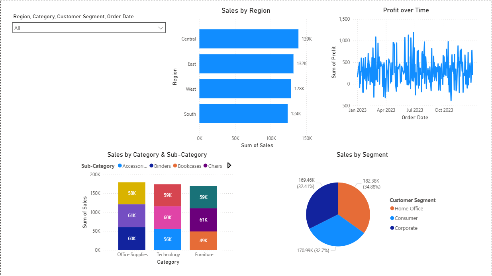

# CodTech Internship - Task 3: Power BI Dashboard

This repository contains Task 3 of the CodTech Data Analysis Internship: an interactive dashboard built using **Power BI** and synthetic superstore sales data.

## 🎯 Objective

To develop a functional business intelligence dashboard using Power BI that provides actionable insights from a sales dataset.

## 📸 Dashboard

  

## 📊 Dashboard Features

- **Sales by Region** (Bar Chart)
- **Profit Over Time** (Line Chart)
- **Sales by Category and Sub-Category** (Stacked Column Chart)
- **Sales by Customer Segment** (Pie Chart)
- **Dynamic Filters** using slicers:
  - Region
  - Category
  - Customer Segment
  - Order Date (range)

## 📁 Files Included

- `superstore_data.csv` — Synthetic dataset used in Power BI
- `superstore_dashboard.pbix` — Power BI Dashboard file
- `dashboard_preview.png` — Optional screenshot of the dashboard
- `README.md` — Description of the task

## 🛠 How to Use

1. Download and open `superstore_dashboard.pbix` using **Power BI Desktop**
2. Use the filters (slicers) to interactively explore sales trends and performance
3. Modify or extend visuals as needed

## 📌 Notes

- The dataset was generated using Python and is entirely synthetic
- The dashboard supports drill-down by category and date

---

**Internship:** CodTech Data Analysis  
**Task:** 3 – Dashboard Development  
**Author:** [Your Name]  
